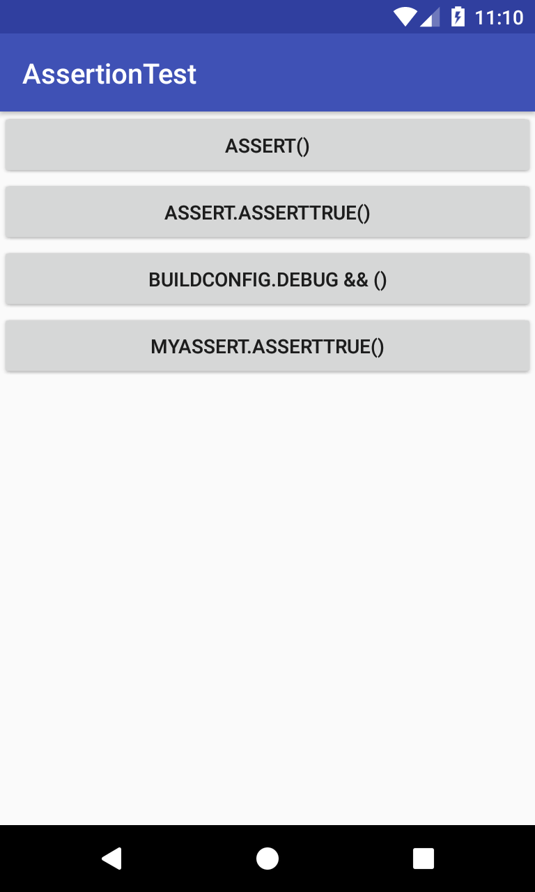

# AssertionTest
Androidアプリ開発におけるAssertionの実装方法についてのメモ。  

1. 組み込みのAssertステートメント  
Javaには、組み込みのAssertステートメントがあります。
Eclipseを用いて開発していたとき（2015年ごろまで）は「adb shell setprop debug.assert 1」コマンドを実行した後に、Eclipseからデバッグ実行したプログラムは、assert行で、処理が中断しました。
Android Studioを用いた開発においては、組み込みのAssertステートメントは機能しません。  
「Some new lint checks, and in particular one which flags uses of the assertion keyword. This does not work reliably on devices and you should use BuildConfig.DEBUG to do conditional checks instead.」  
「いくつかの新しいlintチェック、特にassertionキーワードの使用にフラグを付けるもの。 これはデバイスで確実に動作しないため、代わりにBuildConfig.DEBUGを使用して条件チェックを行う必要があります。」
出典：http://tools.android.com/recent/androidstudio045released

2. JUnitのAssert.assertTrueステートメント  
組み込みのAssertステートメントの代わりとしては、「JUnitのAssert.assertTrueステートメント」があります。  

3. BuildConfig.DEBUGを使用した方法
Android Studio のリリースノートには、「代わりにBuildConfig.DEBUGを使用する必要がある」とあります。

1. 2. 3. の動作確認の結果としては、
1. については、深く調べてはいませんが、リリースノートの通りで、機能


Android 
JavaAsyncTaskクラスを用いた非同期タスクの進捗表示は、API level 25 までは、ProgressDialogクラスを用いることで実現できましたが、API level 26 から、ProgressDialogクラスの使用は非推奨となりました。  
AsyncTaskクラスを用いた非同期タスクの進捗表示を、（ProgressDialogクラスではなく）ProgressBarクラスを用いて実現します。  

今回作成した非同期タスクの進捗表示の仕様は以下。  
・AsyncTaskクラスを用いて非同期タスクを実行する。  
・ProgressBarクラスを用いて進捗を表示する。  
・非同期タスクが実行されていないときは、ProgressBar関連コントロール群を表示しない。  
・非同期タスクが実行されているときは、ProgressBarは表示する。  
・非同期タスクが実行されているときは、タスクをキャンセルするボタンを表示する。  
・非同期タスクが実行されているときは、タスク名、進捗率、進捗数を表示する  

## Screenshots : スクリーンショット
  

## Requirements : 必要条件、依存関係
- Android Studio 3.1.2
- Android SDK 26
- Android Support Repository

## Author : 作者
Nobuki HIRAMINE : [http://www.hiramine.com](http://www.hiramine.com)

## License : ライセンス
```
Copyright 2018 Nobuki HIRAMINE

Licensed under the Apache License, Version 2.0 (the "License");
you may not use this file except in compliance with the License.
You may obtain a copy of the License at

    http://www.apache.org/licenses/LICENSE-2.0

Unless required by applicable law or agreed to in writing, software
distributed under the License is distributed on an "AS IS" BASIS,
WITHOUT WARRANTIES OR CONDITIONS OF ANY KIND, either express or implied.
See the License for the specific language governing permissions and
limitations under the License.
```
